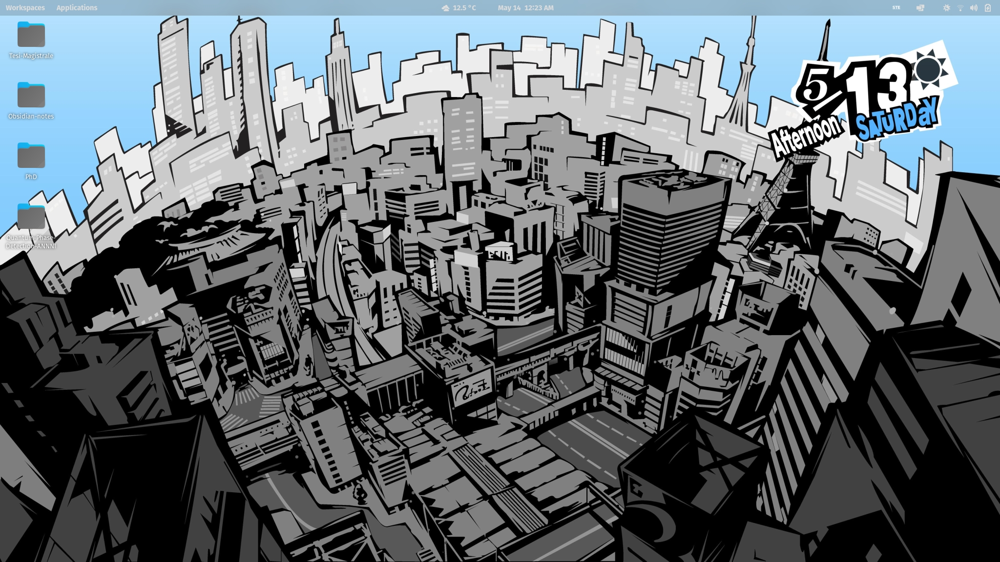
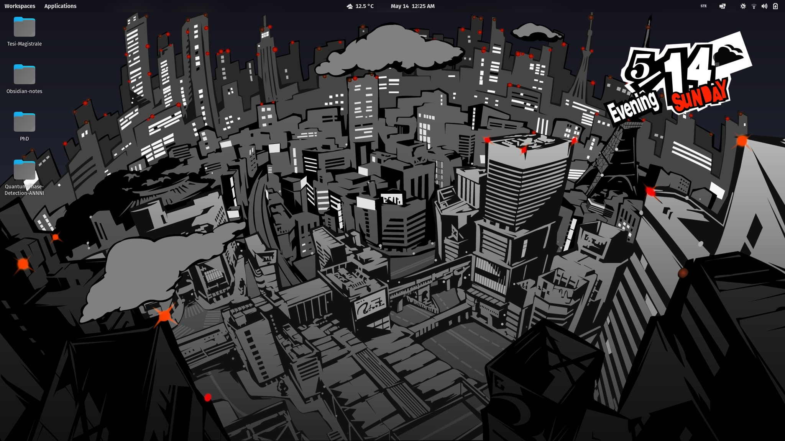

This code automatically updates a background image with the sprites from Persona 5 displaying the current date and Weather!

#### Example: Day


#### Example: Night


It updates automatically as a systemd routine during the day (to update the Time of the Day (Early Morning, Daytime etc.) and the date at midnight).

## Installation
1. Download this repository and run the install.sh script
```
git clone https://github.com/SaverioMonaco/Persona5-ActiveBackground.git
```
```
cd Persona5-ActiveBackground
```
```
chmod +x ./install.sh
```
```
./install.sh
```
