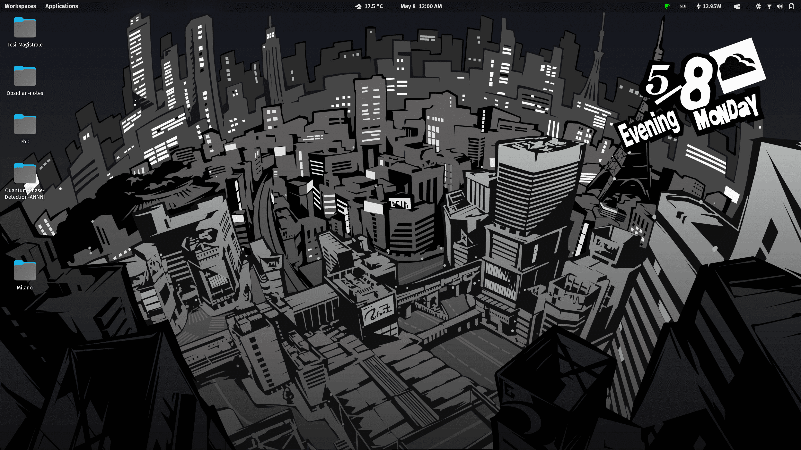

# Persona 5 Background with Calendar (Ubuntu)
This code automatically updates a background image with the sprites from Persona 5 displaying the current date and Weather!



It updates automatically as a systemd routine during the day (to update the Time of the Day (Early Morning, Daytime etc.) and the date at midnight).

## Installation
1. Install the required dependencies:
```
sudo apt install imagemagick
```

2. Download this repository and run the install.sh script
```
git clone https://github.com/SaverioMonaco/Persona5-ActiveBackground.git
```
```
cd Persona5-ActiveBackground
```
```
chmod +x ./install.sh
```
```
./install.sh
```
## What does this code do?
1. Combines the asset sprites into a single one with the correct Month, Day, Week, Time of the day and (eventually) Weather
   1. (If it cannot retrieve the Weather for any reason, no weather information will be shown) 
2. Place the combined sprites on top of the `base.*` image in the `Persona5-ActiveBackground` folder
   1. (Tip: You can change the base image!)
3. Updates the Background with the new one (in `background.jpg`) containing both the base background and the Assets from Persona 5

## FAQ:
1. **I want to change the base image**
    Just substitute the `base.*` file with your desired image.
    Use the script `./refresh` to switch between wallpapers.
2. **The assets is not placed where I would like**
    Different `base.*` images or screen resolution can mess with the placement of the asset, you can tweak the values in `ratios` to see which are the most fitting ones.
3. **How often does this code run?**
   1. At every startup after the computer is connected to the Network
   2. After every suspend
   3. ~~At 3AM, 9AM, 1PM, 4PM, 7PM and Midnight to update the Calendar~~ Every hour, to update the weather and to cover weird unpredicted scenarios.

   However if no change in the Wallpaper needs to be applied, the program will run softly not refreshing the same wallpaper.
